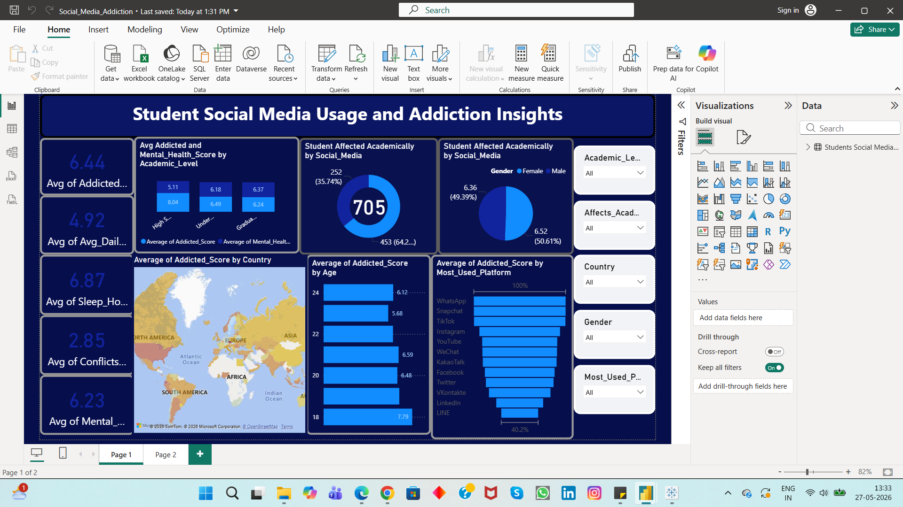

# Students' Social Media Addiction Dashboard

## Project Overview
This project analyzes students' social media usage patterns and their impact on academic performance, sleep quality, and addiction levels using Power BI.

The dashboard provides interactive visual insights into behavioral trends, helping identify how excessive social media usage affects students' daily lives and academic outcomes.

---

## Tools & Technologies Used
- Power BI
- Excel / CSV Dataset
- Data Cleaning
- Data Visualization
- KPI Analysis

---

## Key Objectives
- Analyze student social media usage behavior
- Identify addiction patterns among students
- Evaluate the impact of screen time on sleep and academics
- Build interactive dashboards for data-driven insights

---

## Dashboard Features
- Interactive Power BI Dashboard
- KPI Cards for addiction metrics
- Social media usage analysis
- Academic performance comparison
- Sleep impact visualization
- Filters and drill-down analysis
- Gender and age-based insights

---

## Key Insights
- Higher screen time is associated with reduced sleep quality.
- Students with increased social media usage showed lower academic performance trends.
- Addiction scores varied across age groups and usage patterns.
- Certain social media platforms had significantly higher engagement rates.

---

## Files Included
- `Social_Media_Addiction.pbix` → Power BI Dashboard File
- `dataset.csv` → Dataset used for analysis
- `dashboard.png` → Dashboard Screenshot

---

## Dashboard Preview

(Add your dashboard screenshot here)

```markdown

```

---

## Skills Demonstrated
- Data Cleaning
- Data Transformation
- Exploratory Data Analysis (EDA)
- Dashboard Development
- KPI Reporting
- Data Visualization
- Business Insights Generation

---

## Future Improvements
- Add predictive analytics using Python
- Include sentiment analysis
- Create mobile-responsive dashboard layouts
- Integrate real-time data sources

---

